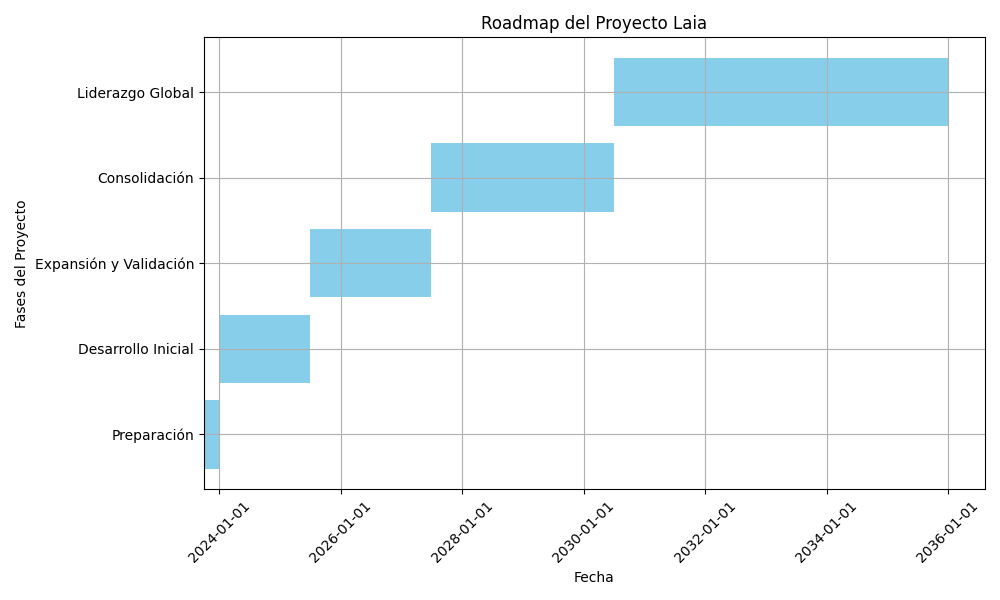

# laia

Laia es un nombre de mujer y una palabra en idioma Català, significa: La que habla dulce o la que se expresa con claridad.

Alguien que es sabia se suele expresar con buenas palabras y expresarse con claridad.

## Hoja de Ruta

