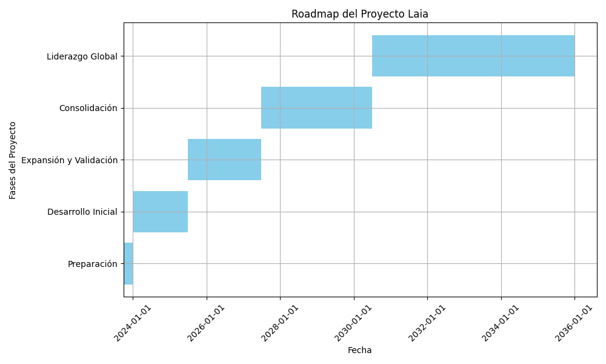

## laia: Inteligencia Artificial Ética

Laia es un nombre de mujer y una palabra que existe, únicamente, en el idioma Catalán, significa: La que habla dulce o la que se expresa con claridad.

Alguien que es sabia se suele expresar con buenas palabras y expresarse con claridad.

### Hoja de Ruta

----

## Laia: Ethical Artificial Intelligence Research Project

<b>Laia</b>, is an open-source initiative founded by Francisco Javier Jiménez Gómez of Brisecom, dedicated to advancing ethical considerations in artificial intelligence (AI). The project name means "The one who speaks sweetly or expresses clearly" in Catalan, symbolizing clarity and wisdom in AI decision-making.

### Project Vision and Mission

Laia aims to foster transparent, responsible, and ethical AI technologies by exploring frameworks for clear AI expression and decision accountability. As AI systems increasingly impact society, establishing trustworthy and ethical models is critical.

### Current Focus

- Conduct foundational research on AI ethics principles embedded in practical AI development.
- Build transparent algorithms that help AI explain decision processes in human-understandable ways.
- Collaborate with EU initiatives and communities targeting trustworthy AI aligned with EU ethical standards.

### Call for Support

At this stage, Laia seeks non-compromise funding specifically to support Francisco Javier Jiménez Gómez’s full-time dedication to initial research efforts. This flexible funding is vital for:

- Sustaining living costs during the research phase.
- Accelerating progress without the delay of formal proposal preparations.
- Establishing collaborations with EU AI ethics initiatives and networks.

### How You Can Help

- Angel investors or grants interested in ethics in AI can provide invaluable early support.
- Institutions or platforms offering flexible research funding with minimal bureaucracy are welcome to connect.
- Collaboration proposals, mentorship, or spreading awareness about Laia’s mission make a big impact.

### Get Involved

Explore the project at GitHub: https://github.com/javi-jimenez/laia

Follow updates and contact Francisco Javier Jiménez Gómez through the Brisecom network or [LinkedIn](https://www.linkedin.com/posts/ximenezfrancisco_github-javi-jimenezlaia-proyecto-laia-activity-7396160782042013697-Hg6v).

Together, we can build ethical, trustworthy AI technologies essential for a sustainable digital future.

## Support This Project

If you find Laia valuable and want to support ethical AI research, consider sponsoring or donating through these platforms:

- [GitHub Sponsors](https://github.com/sponsors/javi-jimenez) – Directly sponsor development on GitHub.
- [Open Collective](https://opencollective.com/brisecom) – Transparent funding and community support.
- [PayPal](https://www.paypal.me/brisecom) – Quick and easy donations.

Every contribution helps me dedicate full-time effort to this important work in AI ethics and transparency. Thank you for your support!
