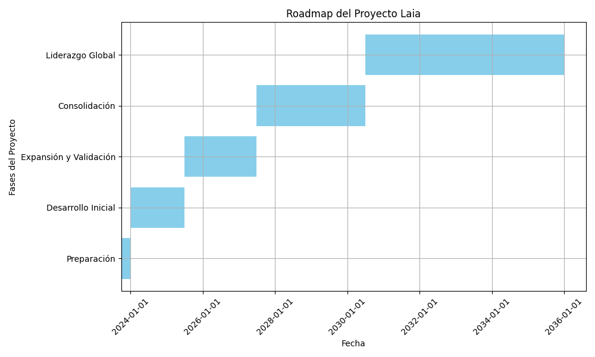

# LAIA — Inteligencia Artificial Ética

> *"La que habla dulce y se expresa con claridad."*

**LAIA** (del valenciano/catalán *Lai·a*: *la que parla dolç o s'expressa amb claredat*) es un proyecto de **investigación en inteligencia artificial ética**, transparente y verificable. Fundado por **Francisco Javier Jiménez Gómez** en **Brisecom**, LAIA combina **lógica formal**, **disciplinas humanísticas** y **transparencia radical** para construir sistemas de IA auditablemente responsables.

---

## 🧭 Misión y Visión

**Misión.** Desarrollar sistemas de inteligencia artificial que prioricen la **ética por diseño**, la **transparencia algorítmica**, el **impacto social positivo**, la **sostenibilidad digital** y la **democratización del conocimiento**.

**Visión.** Un futuro digital donde la tecnología esté al servicio del bienestar humano y donde cada decisión algorítmica pueda ser comprendida, auditada y justificada.

---

## 📌 Estado Actual — Expansión y Validación

> **LAIA se encuentra en su fase de Expansión y Validación (2025–2027).**

Tras las etapas de preparación e investigación, LAIA está **expandiendo** sus capacidades con la IA y los trabajos previos ya realizados, y se encuentra en la **validación comercial** y de **colaboraciones institucionales**: contacto activo con **Naciones Unidas, la Unión Europea y consorcios europeos** (EIC Pathfinder, Horizon Europe), que darán sus frutos el próximo año.

El siguiente diagrama Gantt refleja la **hoja de ruta del proyecto**. La fase actual se sitúa dentro de la etapa de **Expansión y Validación (2025–2027)**, que continúa **en curso**, y se prevé la **consolidación para el verano de 2027**.

**Fases del proyecto:**

| Fase | Periodo | Estado |
|------|---------|--------|
| Preparación | 2023-10 → 2023-12 | ✅ Completada |
| Desarrollo Inicial | 2024-01 → 2025-06 | ✅ Completada |
| **Expansión y Validación** | **2025-07 → 2027-06** | 🟢 **En curso** |
| **Consolidación** | **2027-07 → 2030-06** | ⏳ **Futura** |
| Liderazgo Global | 2030-07 → 2035-12 | ⏳ Futura |

> **Colaboraciones institucionales:** LAIA está trabajando con **Naciones Unidas, la Unión Europea y consorcios europeos** (EIC Pathfinder, Horizon Europe). Estos proyectos operarán con seguridad el próximo año, lo que sitúa la **consolidación** para el **verano de 2027**.

---

## 🔬 Investigación y Whitepapers

LAIA produce **documentos técnicos formales** (whitepapers) que transforman investigación aplicada y casos reales en referencias reproducibles.

📄 **Índice completo:** [`whitepapers/`](whitepapers/README.md)

> Los **PDFs** están disponibles en la [última release de GitHub](https://github.com/javi-jimenez/laia/releases/latest).

| # | Documento | Fecha | PDF |
|---|-----------|-------|-----|
| 01 | [ACS: An Assistant Context Standard for Persistent, Traceable AI Memory](whitepapers/acs-assistant-context-standard.md) | 2025-12-30 | [PDF](https://github.com/javi-jimenez/laia/releases/download/202608270117-LAIA-Whitepapers/acs-assistant-context-standard.pdf) |
| 02 | [Hybrid Intelligence in Forensic Audit](whitepapers/hybrid-intelligence-forensic-audit.md) | 2026-03-19 | [PDF](https://github.com/javi-jimenez/laia/releases/download/202608270117-LAIA-Whitepapers/hybrid-intelligence-forensic-audit.pdf) |
| 03 | [Ethical AI in High-Stakes Engineering](whitepapers/ethical-ai-ballistic-validation.md) | 2026-08-10 | [PDF](https://github.com/javi-jimenez/laia/releases/download/202608270117-LAIA-Whitepapers/ethical-ai-ballistic-validation.pdf) |
| 04 | [Governance of Autonomous Systems](whitepapers/governance-autonomous-systems-accountability.md) | 2024-11-10 | [PDF](https://github.com/javi-jimenez/laia/releases/download/202608270117-LAIA-Whitepapers/governance-autonomous-systems-accountability.pdf) |
| 05 | [Operational Algorithmic Ethics](whitepapers/operational-algorithmic-ethics.md) | 2024-11-15 | [PDF](https://github.com/javi-jimenez/laia/releases/download/202608270117-LAIA-Whitepapers/operational-algorithmic-ethics.pdf) |
| 06 | [Formal Methods vs. Machine Learning](whitepapers/formal-methods-vs-machine-learning.md) | 2025-12-30 | [PDF](https://github.com/javi-jimenez/laia/releases/download/202608270117-LAIA-Whitepapers/formal-methods-vs-machine-learning.pdf) |
| 07 | [Unified World Architecture for MMORPG Ecosystems](whitepapers/unified-world-architecture-mmorpg.md) | 2026-08-18 | [PDF](https://github.com/javi-jimenez/laia/releases/download/202608270117-LAIA-Whitepapers/unified-world-architecture-mmorpg.pdf) |
| 08 | [Universal DNS and Distributed Systems](whitepapers/universal-dns-distributed-systems.md) | 2025-12-22 | [PDF](https://github.com/javi-jimenez/laia/releases/download/202608270117-LAIA-Whitepapers/universal-dns-distributed-systems.pdf) |
| 09 | [AI Collapse and Systemic Risks](whitepapers/ai-collapse-systemic-risks.md) | 2025-12-18 | [PDF](https://github.com/javi-jimenez/laia/releases/download/202608270117-LAIA-Whitepapers/ai-collapse-systemic-risks.pdf) |
| 10 | [The LAIA Operational Framework](whitepapers/laia-operational-framework.md) | 2026-04-15 | [PDF](https://github.com/javi-jimenez/laia/releases/download/202608270117-LAIA-Whitepapers/laia-operational-framework.pdf) |
| 11 | [Command & Control as Information Sovereignty](whitepapers/command-control-information-sovereignty.md) | 2026-03-01 | [PDF](https://github.com/javi-jimenez/laia/releases/download/202608270117-LAIA-Whitepapers/command-control-information-sovereignty.pdf) |

---

## 💼 Servicios Empresariales

LAIA y Brisecom ofrecen servicios profesionales para empresas e instituciones que necesitan **rigor técnico**, **validación independiente** y **cumplimiento normativo** en el uso de inteligencia artificial.

### 🛡️ Cumplimiento y Validación (ENS + IA Act)

Acompañamos a la empresa en **todo el proceso** de validación, obtención y cumplimiento de los principales marcos normativos:

- **Esquema Nacional de Seguridad (ENS):** Diseño de la política de seguridad corporativa, mapeo de controles técnicos y preparación para licitar con garantías ante el sector público español (integrando metodologías como OWASP SAMM 2).
- **Reglamento Europeo de Inteligencia Artificial (EU AI Act):** Evaluación técnica y ética de sistemas de IA corporativos, clasificación de riesgo, validación matemática de sesgos y cumplimiento de la **ISO 42001**.
- **Protección de Datos (GDPR / LOPDGDD):** Auditoría técnica de bases de datos para garantizar limpieza estructural, eliminación de sesgos y trazabilidad legal antes de la ingesta en modelos algorítmicos.

### 🔄 Optimización de Procesos y Productividad

Revisamos los **procesos operativos** de la organización y aconsejamos mejoras para:

- Aumentar la **productividad** y reducir fricciones internas;
- Optimizar la **arquitectura de sistemas** y eliminar deuda técnica;
- Fortalecer la **presencia en el mercado** y la ventaja competitiva;
- Convertir la ambigüedad técnica en **guía escrita defendible** ante la dirección, gobernanza y compras.

### 🧩 Casos de Uso y Redacción de Documentos

Gestionamos **todo tipo de incidencias y situaciones** empresariales, redactando informes y documentos técnicos que convierten un problema en una decisión fundamentada. También asistimos en la **adaptación al cumplimiento de normativas** y a los **objetivos empresariales o sectoriales**. Algunos de los casos más habituales:

#### Consultoría Logística y Operaciones
- Revisión de un **cuello de botella logístico** y propuesta de rediseño de flujo;
- Análisis de **cadena de suministro**, rutas, almacenamiento y distribución;
- Evaluación de **capacidad operativa** y reducción de costes operativos;
- Documentación técnica de un proceso para gobernanza o compras.

#### Consultoría de Management y Estrategia
- **Estudio de mercado** y análisis de posicionamiento competitivo;
- Evaluación de una **estrategia digital** o de transformación;
- Revisión de **modelo de negocio** y propuesta de diversificación;
- Redacción de **informes ejecutivos** y justificaciones para la dirección.

#### Recursos Humanos y Organización
- Aclaración de **fricciones en las relaciones humanas** dentro de la organización;
- Análisis de **estructura de equipos**, roles y asignación de responsabilidades;
- Evaluación de **procesos de selección, retención y clima laboral**;
- Redacción de **políticas internas** y documentación de procedimientos.

#### Incidencias, Cumplimiento y Normativa
- Gestión y documentación de **incidencias** técnicas, operativas o de cumplimiento;
- Asistencia en la **adaptación al cumplimiento** de normativas (ENS, EU AI Act, GDPR/LOPDGDD) y estándares sectoriales;
- Alineación con **objetivos empresariales y del sector**;
- Preparación de la organización para **licitar** ante el sector público con garantías.

#### Producto, Servicio e Innovación
- Dar forma a una **idea de producto o servicio** nuevo desde una hipótesis temprana;
- Desarrollo de un **dispositivo, concepto o vía técnica** hasta una propuesta viable;
- Evaluación de **opciones de modernización, interoperabilidad y descomposición de servicios**.

### 🧠 Problemas Atascados y Alta Complejidad

Existe una categoría de problemas empresariales que **pocos pueden resolver**: son técnicamente complejos, engorrosos, o llevan años enquistados porque nadie se atreve a tocarlos. Suelen requerir **formalización rigurosa**, **cálculo con IA** y un enfoque estructurado que combine lógica formal con supervisión humana.

LAIA está diseñada exactamente para desbloquear este tipo de situaciones. Si un problema lleva tiempo atascado, es probable que necesite lo que ofrecemos: **formalizar lo que está mal definido** y **calcular lo que nadie ha calculado**.

Casos de este perfil que resolvemos:

#### 🔩 Deuda Técnica y Sistemas Heredados
- **Proyectos parados** durante meses o años por miedo a romper lo que funciona;
- **Sistemas críticos heredados** (mainframes, legacy) que nadie se atreve a tocar;
- **Refactorización segura** con validación matemática del comportamiento antes y después;
- Documentación y **modelado formal** de sistemas opacos sin especificación.

#### 🧮 Formalización y Cálculo con IA
- **Validación matemática** de diseños, fórmulas o conceptos técnicos (del estilo del caso de validación balística);
- **Cálculos complejos** que requieren lógica formal y razonamiento estructurado;
- Conversión de **conocimiento tácito de expertos** en reglas formales y documentación (especialmente ante jubilaciones o salidas de personal clave);
- **Modelado cuantitativo** de riesgos, costes y escenarios.

#### 🕵️ Auditorías y Casos Enquistados
- **Auditoría forense** de irregularidades, fraude o suplantación que nadie ha podido resolver (del estilo del caso "Sr. X");
- **Análisis de datos sucios** y normalización de información dispersa o caótica;
- **Reconstrucción de trazabilidad** cuando los registros son incompletos o contradictorios;
- Desbloqueo de **casos históricos** bloqueados por falta de método.

#### 🏗️ Migraciones e Integraciones de Alto Riesgo
- **Migración de sistemas críticos** con garantías de continuidad y validación previa;
- **Integración de sistemas incompatibles** (interoperabilidad entre plataformas dispares);
- **Eliminación de dependencia de proveedor** (vendor lock-in) hacia infraestructuras soberanas;
- Evaluación técnica **antes de decisiones estratégicas irreversibles**.

#### ⚖️ Cumplimiento que Nadie Puede Afrontar Solo
- **Preparación para licitaciones** públicas con justificaciones técnicas sólidas;
- Adaptación a normativas complejas (**ENS, EU AI Act, GDPR/LOPDGDD**) cuando el esfuerzo interno es inasumible;
- **Redacción de informes defendibles** ante gobernanza, auditoría y compras;
- Asistencia en **todo el proceso** de obtención y cumplimiento, no solo en la entrega final.

> **La clave:** estos problemas no se resuelven con más horas de trabajo, sino con **un método distinto** — formalización rigurosa, cálculo asistido por IA y supervisión humana. Esa es exactamente la combinación que ofrece LAIA.

### 📊 Ofertas de Advisory

Dos modalidades de contratación, respaldadas por LAIA para investigación, análisis, validación y razonamiento estructurado:

#### 1. Enterprise Architecture Advisory — Año 1 / Launch Tier *(Subscripción)*

- **Precio:** EUR 600 / mes
- **Alcance:** Advisory mensual de arquitectura empresarial, revisiones de sistemas y resolución de problemas técnicos complejos.
- **Capacidad incluida:** hasta **2 informes técnicos o tareas de revisión** por mes.
- **Ideal para:** equipos con necesidades recurrentes de análisis y continuidad.

#### 2. Enterprise Architecture Advisory — Informe Único *(Single Report)*

- **Precio:** EUR 1.500 (pago único)
- **Alcance:** un informe técnico independiente, revisión de sistema o entregable específico.
- **Ideal para:** intervenciones puntuales, evaluación técnica antes de una decisión estratégica u opinión externa documentada.

#### 💳 Compra Directa en Línea

LAIA ofrece **venta directa en internet** de sus servicios de advisory e informes técnicos, con pago seguro en línea:

- **Informe único:** pago único de **EUR 1.500**.
- **Subscripción mensual (Launch Tier):** pago recurrente de **EUR 600/mes**.

> 🔗 **Compra y más información:** visita **brisecom.org/services**, donde encontrarás los **formularios de pago en línea** y toda la información sobre los servicios de Brisecom.

Si tienes **preguntas antes de comprar**, contacta en **info@brisecom.org** y te indicaremos el enlace de pago correspondiente. La compra se procesa de forma segura e inmediata, y el entregable se coordina tras la confirmación del pago.

> 📬 Para alcances personalizados o consultas comerciales: **info@brisecom.org**

---

## 🤝 Cómo Apoyar el Proyecto

Puedes contribuir al desarrollo de LAIA de varias formas:

- **🛒 Compra directa en línea** — contrata un informe único o la subscripción mensual a través de [brisecom.org/services](https://brisecom.org/services/), donde encontrarás los formularios de pago.
- **Subscríbete a los servicios de advisory** — el apoyo recurrente financia la investigación continua.
- **Contrata un informe único** — cada encargo financia investigación aplicada.
- **Sponsor en GitHub** — [github.com/sponsors/javi-jimenez](https://github.com/sponsors/javi-jimenez)
- **Donación por PayPal** — [paypal.me/brisecom](https://www.paypal.me/brisecom)
- **Colaboración y mentoría** — propuestas de colaboración, revisión de whitepapers o difusión del proyecto.

Cada contribución ayuda a dedicar esfuerzo a tiempo completo a esta labor en ética y transparencia de la IA.

---

## 🌐 Enlaces

- **Web del proyecto LAIA:** [laia.brisecom.org](https://laia.brisecom.org/)
- **Brisecom (Think Tank):** [brisecom.org](https://brisecom.org/)
- **Servicios y compra en línea:** [brisecom.org/services](https://brisecom.org/services/)
- **Repositorio GitHub:** [github.com/javi-jimenez/laia](https://github.com/javi-jimenez/laia)
- **LinkedIn:** [Francisco Javier Jiménez Gómez](https://www.linkedin.com/posts/ximenezfrancisco_github-javi-jimenezlaia-proyecto-laia-activity-7396160782042013697-Hg6v)

---

*LAIA — Inteligencia Artificial Ética para el Bienestar Humano.*
*Transparencia, rigor y responsabilidad en cada decisión algorítmica.*
