A continuación, te proporciono un archivo en formato **DOT** (el formato utilizado por Graphviz) que contiene todos los diagramas que describí anteriormente. Puedes descargar este archivo y usarlo en Graphviz o en cualquier herramienta compatible.

### Archivo: `arquitectura_laia.dot`

```dot
// Diagrama 1: Arquitectura General de la Nube
digraph ArquitecturaGeneral {
    rankdir=LR;
    node [shape=box, style=rounded];

    Usuarios [label="Usuarios (Colaboradores)"];
    APIGateway [label="API Gateway"];
    Autenticacion [label="Servicio de Autenticación"];
    Colaboracion [label="Servicio de Colaboración"];
    Almacenamiento [label="Servicio de Almacenamiento"];
    Procesamiento [label="Servicio de Procesamiento"];
    BDSQL [label="Base de Datos SQL"];
    BDNoSQL [label="Base de Datos NoSQL"];
    Balanceador [label="Balanceador de Carga"];
    Servidores [label="Servidores de Aplicaciones"];
    Cola [label="Servicios de Cola"];
    Monitoreo [label="Servicios de Monitoreo"];
    Firewall [label="Firewall"];
    VPN [label="VPN"];
    CDN [label="CDN"];

    Usuarios -> APIGateway;
    APIGateway -> Autenticacion;
    APIGateway -> Colaboracion;
    APIGateway -> Almacenamiento;
    APIGateway -> Procesamiento;
    Autenticacion -> BDSQL;
    Colaboracion -> BDSQL;
    Almacenamiento -> BDNoSQL;
    Procesamiento -> BDNoSQL;
    APIGateway -> Balanceador;
    Balanceador -> Servidores;
    Servidores -> Cola;
    Servidores -> Monitoreo;
    Usuarios -> Firewall;
    Firewall -> VPN;
    Firewall -> CDN;
}

// Diagrama 2: Flujo de Colaboración
digraph FlujoColaboracion {
    rankdir=TB;
    node [shape=box, style=rounded];

    InicioSesion [label="Usuario Inicia Sesión"];
    Autenticacion [label="Servicio de Autenticación"];
    Dashboard [label="Dashboard Personalizado"];
    Chat [label="Chat en Tiempo Real"];
    Archivos [label="Compartir Archivos"];
    Sincronizacion [label="Sincronización de Cambios"];
    Almacenamiento [label="Servicio de Almacenamiento"];

    InicioSesion -> Autenticacion;
    Autenticacion -> Dashboard;
    Dashboard -> Chat;
    Dashboard -> Archivos;
    Chat -> Sincronizacion;
    Archivos -> Sincronizacion;
    Sincronizacion -> Almacenamiento;
}

// Diagrama 3: Infraestructura de Servidores
digraph InfraestructuraServidores {
    rankdir=TB;
    node [shape=box, style=rounded];

    Presentacion [label="Capa de Presentación\n(Servidores Web)"];
    Aplicacion [label="Capa de Aplicación\n(Contenedores/Microservicios)"];
    Datos [label="Capa de Datos\n(Bases de Datos SQL/NoSQL)"];
    Almacenamiento [label="Capa de Almacenamiento\n(S3, Google Cloud Storage)"];
    Red [label="Capa de Red\n(Balanceadores, Subredes)"];

    Presentacion -> Aplicacion;
    Aplicacion -> Datos;
    Datos -> Almacenamiento;
    Aplicacion -> Red;
}

// Diagrama 4: Seguridad y Monitoreo
digraph SeguridadMonitoreo {
    rankdir=LR;
    node [shape=box, style=rounded];

    Autenticacion [label="Autenticación y Autorización\n(OAuth2, JWT)"];
    Cifrado [label="Cifrado\n(TLS/SSL, AES-256)"];
    Monitoreo [label="Monitoreo\n(Prometheus, Grafana)"];
    Auditoria [label="Auditoría\n(ELK Stack)"];

    Autenticacion -> Cifrado;
    Cifrado -> Monitoreo;
    Monitoreo -> Auditoria;
}

// Diagrama 5: Escalabilidad y Alta Disponibilidad
digraph EscalabilidadAltaDisponibilidad {
    rankdir=TB;
    node [shape=box, style=rounded];

    Escalabilidad [label="Escalabilidad Horizontal\n(Balanceadores, Auto Scaling)"];
    AltaDisponibilidad [label="Alta Disponibilidad\n(Replicación, Regiones Múltiples)"];
    Recuperacion [label="Recuperación ante Desastres\n(Backups, DRP)"];

    Escalabilidad -> AltaDisponibilidad;
    AltaDisponibilidad -> Recuperacion;
}
```



---

### Instrucciones para descargar y usar el archivo:

1. **Descargar el archivo**:
   - Copia el contenido anterior.
   - Pega el contenido en un archivo de texto y guárdalo con la extensión `.dot` (por ejemplo, `arquitectura_laia.dot`).

2. **Generar los diagramas**:
   - Instala Graphviz en tu máquina ([descarga aquí](https://graphviz.org/download/)).
   - Usa el siguiente comando en la terminal para generar una imagen a partir del archivo DOT:
     ```bash
     dot -Tpng arquitectura_laia.dot -o arquitectura_laia.png
     ```
   - Esto generará un archivo `arquitectura_laia.png` con todos los diagramas.

3. **Usar herramientas online**:
   - Si prefieres no instalar Graphviz, puedes usar [Graphviz Online](https://dreampuf.github.io/GraphvizOnline/).
   - Copia y pega el contenido del archivo `.dot` en la herramienta y haz clic en "Generate Graph".
